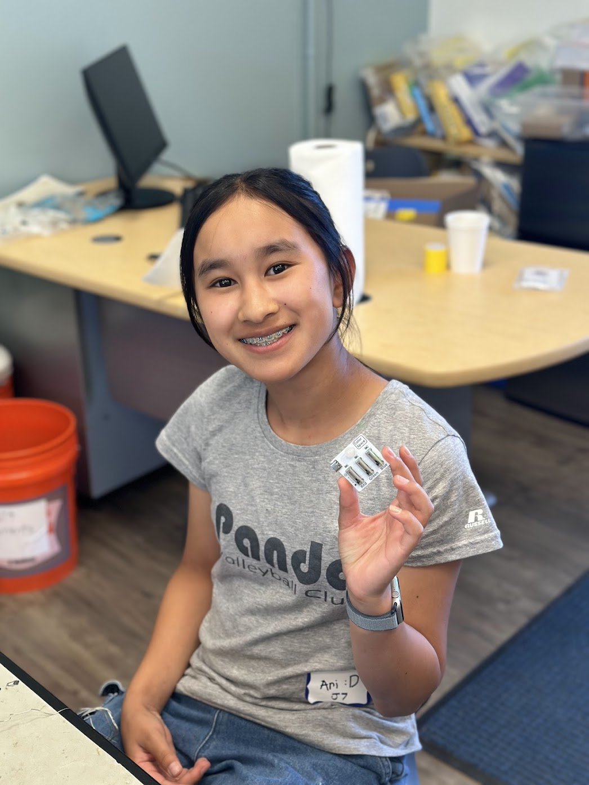
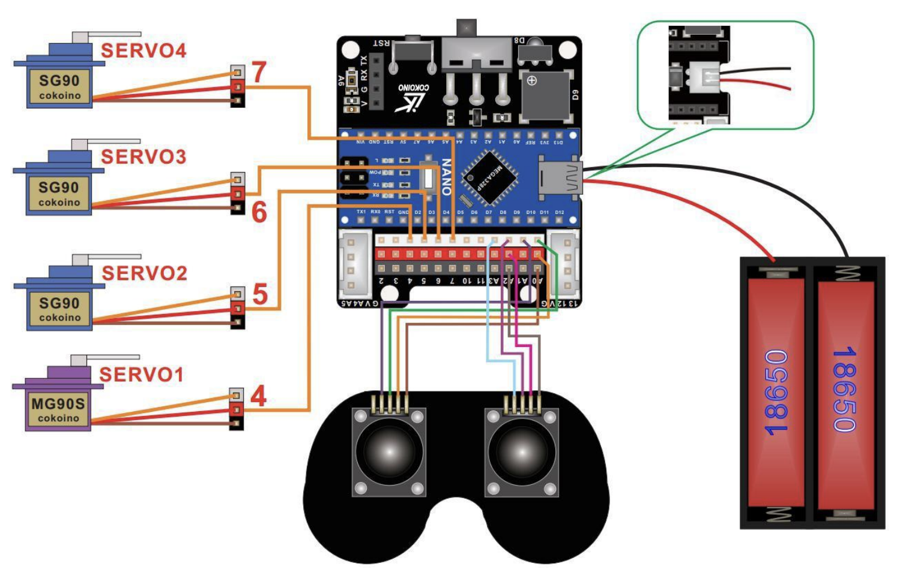

# Three Joint Robotic Arm
A robotic arm that moves when someone uses the joystick. The servos in the robotic arm spin so that the robotic arm can move in three ways, four including the claw.

| **Engineer** | **School** | **Area of Interest** | **Grade** |
|:--:|:--:|:--:|:--:|
| Ari S | The Harker School | Computer Science | Incoming Eighth Grader

# Main Project Picture:
.png)

# Final Milestone

<iframe width="560" height="315" src="https://www.youtube.com/embed/j33U-BX4AIM?si=925eJknJvDAqI6om" title="YouTube video player" frameborder="0" allow="accelerometer; autoplay; clipboard-write; encrypted-media; gyroscope; picture-in-picture; web-share" referrerpolicy="strict-origin-when-cross-origin" allowfullscreen></iframe>

## Description
For my modifications, I decided to code my robotic arm to dance in two different ways. One way, it moves from the left to the right, dipping its head in between. The second dance moves the robotic arm left, bopping its "head" twice, and then moving it to the right, doing the same. Instead of using the buttons on the joysticks, I decided to use regular buttons, because the joystick buttons were not working and it was only outputting a digital low. First, while testing the buttons and implementing it into my robotic arm, I used a breadboard to hold my buttons so that I could easily take the buttons off and/or on if I needed to change the wiring. Later, when I made sure the wiring and the buttons worked, I used a perfboard and soldered my buttons and wires on so that they were permanent.

## Challenges
**Buttons**

First, I tried to use the joystick buttons to control when and which dance to run, but I could not get the button to act properly. I connected the SW pin on the joystick to the digital 11 pin. To test if it works when the button is pressed, I made the result of the digital read print on the Serial. That did not work; it read 0 the entire time, whether or not I pressed the button or not. Then, I kept on switching which digital pin the joystick is ouputing to, but I still got the same result. Then, I tried to use:
```
pinMode(2, INPUT_PULLUP);
//instead of
pinMode(2, INPUT);
```
This time, it worked a little bit: when I was pressing the button, it outputted 1, and when I was not, it outputted 0. However, sometimes it randomly outputs 1. That was when I decided to use separate buttons instead of the built-in buttons on the joystick. When I tried out the regular buttons, it worked! After that, I worked on the code for my first dance.

**Dance 1**
While coding the first dance for my robot, I struggled to get all the motors to move at the same time. At first, I tried writing the motor commands one after the other, but they ran one by one instead of together. I realized I needed a way to control them simultaneously rather than sequentially. After some trial and error, I figured out that using a while loop allowed me to run all the motor commands in sync. Once I implemented the loop correctly, the robot was finally able to perform the dance smoothly with all parts moving together.

**Dance 2**
While coding the second dance, I ran into an issue where the robot kept getting stuck in the first half of the routine. No matter what I changed, it never moved on to the second part of the dance. After checking my code closely, I realized the problem was in my for loop declaration. I had written ```int i``` without setting it equal to 0, so the loop wasn't starting properly. Once I changed it to ````int i = 0```, the dance worked perfectly from start to finish.

## Next Steps
**What I would do if I had more time**
I want to improve my robot by reducing its glitches through better software calibration and smoother motor control. I also plan to add a human recognition system using cameras and sensors to accurately detect and track human movement. This will allow the robot arm to mimic or respond to human motions for more cool modifications.

# Final Milestone

<iframe width="560" height="315" src="https://www.youtube.com/embed/j33U-BX4AIM?si=925eJknJvDAqI6om" title="YouTube video player" frameborder="0" allow="accelerometer; autoplay; clipboard-write; encrypted-media; gyroscope; picture-in-picture; web-share" referrerpolicy="strict-origin-when-cross-origin" allowfullscreen></iframe>

## Description
To make sure that the joystick accually controls the robot arm, I had to make code. I coded my code per joystick. I coded the left joystick first, which controls motor of the base and the second joint. I coded it so that if I turn the joystick left and right it twists the base left and right, and if I turn the joystick up and down, the second joint bends down and up. Then I coded the right joystick which controls thrid joint and the claw. The left and right movements control the claw and the up and down movements control the third joint. First I had problems connecting my computer to my arduino nano board, so I had to replace the USB-A TO USB-C adapter becuase it was not working.

## Challenges
I had trouble connecting my arduino nano to my computer because my computer kept on disconnecting from the port. First I changed out my wire connecting my arduino and my computer, but that did not change anything. Then, I changed out the adapter, and it suddenly started connecting. Therefore, I was able to implement my code to the arduino so that I could control the robotic arm using the joystick.

After I completed my first revision of my code, the robot could not move left or down if the clamp has already been closed. To fix that I had to switch up the direction of the clamp so that instead of the right movement closing the clamp, the left movement closes it. After that revision was implemented, the robot could move seamlessly without any problems.

## Next Steps
**Modifications**
- Make the Robot Dance with the Joystick button
- I also want to control it with my computer (if I type "Dance" on the terminal, the robot starts dancing)
- Add googly eyes on the claw so that it the eyes get wider apart when the claw opens.

# Second Milestone: Building the Robotic Arm

<iframe width="560" height="315" src="https://www.youtube.com/embed/uqtCaf1NxMw?si=jvoUUuXZFAiw9Wqr" title="YouTube video player" frameborder="0" allow="accelerometer; autoplay; clipboard-write; encrypted-media; gyroscope; picture-in-picture; web-share" referrerpolicy="strict-origin-when-cross-origin" allowfullscreen></iframe>

## Description
To complete my second milestone, finishing building the robotic arm, I started assemhling the body of the robotic arm. I assembled the base of the arm which includes the battery and the nano shield. I switched out the Lithium Ion batteries to AA batteries. Therefore, I had to tape it on to the base since there was no dedicated spot.

I had to write all of the servos to 90° so that all of the servos would turn to the correct direction when I implemented the main code for the entire robot arm. I had to set all of them to 90° so the servos turn to the correct direction when I move the joystick. At first, I did not know how to calibrate all my servos to 90°, but then I found code from the portfolio of Cokoino, the maker of the Three-Joint Robotic Arm kit. Since I forgot to set my base servo to 90° before I implemented it in my robot arm, so I had to take many parts off to fix the issue.

While I was assembling the second joint of the robotic arm, two pieces broke off while I assembling them because I screwed on the servo screws too tightly. First, we tried to dimension the broken pieces so that we could 3D print a new piece. Luckily, we were able to find replacement parts and I could complete assembling the rest of the arm.

### Writing to 90° Code:
```
#include<Servo.h>
Servo myservo1;  // Create a servo class
Servo myservo2;  // Create a servo class
Servo myservo3;  // Create a servo class
Servo myservo4;  // Create a servo class

void setup() {  
myservo1.attach(4);  //Set the servo control pin as D4
myservo2.attach(5);  //Set the servo control pin as D5
myservo3.attach(6);  //Set the servo control pin as D6
myservo4.attach(7);  //Set the servo control pin as D7
delay(100);          //delay 100ms 
}

void loop() {
 myservo1.write(90);  //The servo is 90 degrees
 myservo2.write(90);  //The servo is 90 degrees
 myservo3.write(90);  //The servo is 90 degrees
 myservo4.write(90);  //The servo is 90 degrees
 delay(1000);
 }
```

## Challenges
While I was implementing the second joint of my robotic arm, two pieces that hold the entirety of the arm broke while I was attaching a servo on. Initially, I tried to fix it by superglueing it on, but the superglue did not dry as fast as I wanted it to and left bumpy white streaks all over the plastic pieces. Then, I realized that I would have to print the parts in order for me to finsh my project. I tried to look for online measurements so I could 3D print the part, but there seemed to not be any detailed measurements. So, I decided to measure them myself. I could not find an electrical caliber, so I tried to use a manual caliber to get measurements so I could 3D print a piece using Autodesk Fusion 360. Fortunately, I was able to find replacement parts from another kit and I could complete assembling the rest of the arm.

## New Steps
For my next milestone, I will have to code the robotic arm so that the joystick can control the arm's movements.


# First Milestone: Testing the Servos

<iframe width="560" height="315" src="https://www.youtube.com/embed/4fMHdtYCE2Y?si=LOW1Mc4TG0xlK4kw" title="YouTube video player" frameborder="0" allow="accelerometer; autoplay; clipboard-write; encrypted-media; gyroscope; picture-in-picture; web-share" referrerpolicy="strict-origin-when-cross-origin" allowfullscreen></iframe>

## Description
For my main project at Bluestamp, I chose to do the Three-Joint Robotic Arm. I chose it because it seemed an interesting way to show what I will learn here at Bluestamp. To test the servos, I needed to download this code called "Sweep," which makes the servo's arm move left and right in a sweeping motion, just as the name suggests. To download it on my computer, I went to File, then clicked on the Servo code to get code that makes the servo arm sweep. Proper assembly at this stage is essential for the robot arm to follow controller commands accurately. 

The next step was to test the joystick by using the Cokoino joystick test code. The code reads what the joystick outputs (x, y and z values). For my left joystick, GND, 5V were connected to A0. The VRx pin was connected to the signal pin A0. The VRy pin was connected to the signal pin A1. The variable orientations of the joystick correspond to different voltages that get sent to the ADC pins on the NANO and get converted to digital values that I can see. If the values for x and y changes when someone moves the joystick, that means that the joystick is working properly. 

### Sweep Code:
```
#include <Servo.h>

Servo myservo;  // create Servo object to control a servo
// twelve Servo objects can be created on most boards

int pos = 0;    // variable to store the servo position

void setup() {
  myservo.attach(10);  // attaches the servo on pin 9 to the Servo object
}

void loop() {
  for (pos = 0; pos <= 180; pos += 1) { // goes from 0 degrees to 180 degrees
    // in steps of 1 degree
    myservo.write(pos);              // tell servo to go to position in variable 'pos'
    delay(15);                       // waits 15 ms for the servo to reach the position
  }
  for (pos = 180; pos >= 0; pos -= 1) { // goes from 180 degrees to 0 degrees
    myservo.write(pos);              // tell servo to go to position in variable 'pos'
    delay(15);                       // waits 15 ms for the servo to reach the position
  }
}
```

## Challenges
Because my code could not find the right port for the Arduino app to connect to, I had to restart my computer. Then, my computer could find the non-Bluetooth port that I can successfully use.

## New Steps
For my next milestone, I will finish building my 3-joint robotic arm. To complete my entire project, I will also have to make code for the arm to actually move.

# Starter Project Picture:

  
# Starter Project Milestone

<iframe width="560" height="315" src="https://www.youtube.com/embed/1MOVeSZ_zO0?si=YhtbP7l8hZccBY3d" title="YouTube video player" frameborder="0" allow="accelerometer; autoplay; clipboard-write; encrypted-media; gyroscope; picture-in-picture; web-share" referrerpolicy="strict-origin-when-cross-origin" allowfullscreen></iframe>

## Description
For my starter project at Bluestamp, I chose the RGB color sliders. Before my experience at Bluestamp, I had never worked with circuits, so I chose the RGB color sliders to learn about circuits and soldering irons. I thought it would be a good idea to familiarize myself with circuits and Arduinos because my final project uses them as well. For my RGB color sliders, I soldered the pieces on using a soldering iron. The way it works is that if you push one of the red, green, and blue sliders, it sends a signal to the LED, resulting in the color of the light changing. Each of the sliders has a small resistor near it to prevent the circuit from short-circuiting.

## Challenges
When I finished soldering everything on my circuit, it was time to start testing my project. Unfortunately, none of the sliders worked, and the LED did not light up. Eventually, I did a multimeter connectivity test to see if all my soldering was perfect. When all of the connections made a buzz, it was then evident that I did not position the LED in the correct orientation. Then, I tried to desolder the joints, but without any luck. I had to redo the entire project, but, fortunately, the second time I made the RGB color sliders, they were fully functional.

## Next Steps
Now that this project is completed, I have a better understanding of circuits, soldering, and LEDs.

# Schematics 
## Testing Servos Schematics:

## Robotic Arm Schematics:

  

# Code

```
#include <Servo.h>

int basecurpos = 90;
int joint2curpos = 90;
int joint3curpos = 90;
int clawcurpos = 90;
Servo baseservo4;
Servo joint25;
Servo joint36;
Servo claw7;
bool danceon = false;
//int curpos; I don't think this does anything but just to make be im commenting it out
//int countl = 0; I don;t htink i need this either

void setup() {
  Serial.begin(9600); 
  pinMode(2, INPUT_PULLUP);
  baseservo4.attach(4);
  joint25.attach(5);
  joint36.attach(6);
  claw7.attach(7);
}

void dance() {         //dance code
  //baseservo4.write(90);
  //basecurpos = 90;
  joint25.write(90);
  joint2curpos = 90;
  joint36.write(90);
  joint3curpos = 90;
  //joint25.write(45);  //this is not affected if the button is pressed to make it stop or not
  //joint2curpos = 45;
  //joint36.write(135);
  //joint3curpos = 135;
  claw7.write(90);
  clawcurpos = 90;
  if (danceon) {
    baseservo4.write(180);  //set all the motors to the left position so it is easier to move the robotic arm
    basecurpos = 180;
    delay(10);
    while(danceon = true) {
      for (int i = 0; i <= 90; i += 4) {
        baseservo4.write(180 - i);
        basecurpos = 180 - i;
        delay(10);

        joint25.write(90-(i/2));
        joint2curpos = 90-(i/2);
        delay(10);

        joint36.write(90+(i/2));
        joint3curpos = 90+(i/2);
        
        int value;
        value = digitalRead(2);
        if (value == 0) {
          while (digitalRead(2) == 0) {
            delay(10);
          }
          danceon = !danceon;
          return;
        }
        delay(15);
      }
      for (int i = 0; i <= 90; i += 4) {
        baseservo4.write(90 - i);
        basecurpos = 90 - i;
        delay(10);

        joint25.write(45+(i/2));
        joint2curpos = 45+(i/2);
        delay(10);

        joint36.write(135-(i/2));
        joint3curpos = 135-(i/2);
        
        int value;
        value = digitalRead(2);
        if (value == 0) {
          while (digitalRead(2) == 0) {
            delay(10);
          }
          danceon = !danceon;
          return;
        }
        delay(15);
      }
      for (int i = 0; i <= 90; i += 4) {
        baseservo4.write(0 + i);
        basecurpos = 0 + i;
        delay(10);

        joint25.write(90-(i/2));
        joint2curpos = 90-(i/2);
        delay(10);

        joint36.write(90+(i/2));
        joint3curpos = 90+(i/2);
        
        int value;
        value = digitalRead(2);
        if (value == 0) {
          while (digitalRead(2) == 0) {
            delay(10);
          }
          danceon = !danceon;
          return;
        }
        delay(15);
      }
      for (int i = 0; i <= 90; i += 4) {
        baseservo4.write(90 + i);
        basecurpos = 90 + i;
        delay(10);

        joint25.write(45 + (i/2));
        joint2curpos = 45 + (i/2);
        delay(10);

        joint36.write(135-(i/2));
        joint3curpos = 135-(i/2);
        
        int value;
        value = digitalRead(2);
        if (value == 0) {
          while (digitalRead(2) == 0) {
            delay(10);
          }
          danceon = !danceon;
          return;
        }
        delay(15);
      }
    }
  } else {
    baseservo4.write(90);
  }
}


void loop() {
  int value = 0;
  baseservo4.write(basecurpos);
  joint25.write(joint2curpos);
  joint36.write(joint3curpos);
  claw7.write(clawcurpos);

  //left joystick
  int xlvalue = 0;
  int ylvalue = 0;
  xlvalue = analogRead(A0);
  Serial.println(xlvalue);
  ylvalue = analogRead(A1);
  Serial.println(ylvalue);
    //base
  if (ylvalue == 0) {
    baseservo4.write(basecurpos - 5);
    basecurpos -= 5;
  }
  if (ylvalue == 1023) {
    baseservo4.write(basecurpos + 5);
    basecurpos += 5;
  }

    //joint 2
  if (xlvalue == 0) {
    joint25.write(joint2curpos - 5);
    joint2curpos -= 5;
  }
  if (xlvalue == 1023) {
    joint25.write(joint2curpos + 5);
    joint2curpos += 5;
  }

  //right joystick
  int xrvalue = 0;
  int yrvalue = 0;
  xrvalue = analogRead(A2);
  yrvalue = analogRead(A3);
    //claw
  if (yrvalue == 0) {
    claw7.write(clawcurpos + 5);
    clawcurpos += 5;
  }
  if (yrvalue == 1023) {
    claw7.write(clawcurpos - 5);
    clawcurpos -= 5;
  }

  //joint 3
  if (xrvalue == 0) {
    joint36.write(joint3curpos + 5);
    joint3curpos += 5;
  }
  if (xrvalue == 1023) {
    joint36.write(joint3curpos - 5);
    joint3curpos -= 5;
  }

  //button dance
  value = digitalRead(2);
  if (value == 0) {
    while (digitalRead(2) == 0) {
      delay(10);
    }
    danceon = !danceon;
    dance();
  }

  delay (15);
}

```

# Bill of Materials
Here's where you'll list the parts in your project. To add more rows, just copy and paste the example rows below.
Don't forget to place the link of where to buy each component inside the quotation marks in the corresponding row after href =. Follow the guide [here]([url](https://www.markdownguide.org/extended-syntax/)) to learn how to customize this to your project needs. 

| **Part** | **Note** | **Price** | **Link** |
|:--:|:--:|:--:|:--:|
| 3-Joint Robotic Arm Kit | Has all the materials for building the robotic arm | $49.99 | <a href="https://www.amazon.com/LK-COKOINO-Compliment-Engineering-Technology/dp/B081FG1JQ1?ref_=ast_sto_dp"> Link </a> |
| 5 AA Battery Holder with Wires | Gives power to to the whole robotic arm | $4.00 | <a href="https://www.amazon.com/LampVPath-Battery-Holder-Leads-Wires/dp/B07WRQ44YK/ref=asc_df_B07WRQ44YK?mcid=802884bb72b83218ac1b54c06bf994d4&hvocijid=6360277807138455168-B07WRQ44YK-&hvexpln=73&tag=hyprod-20&linkCode=df0&hvadid=721245378154&hvpos=&hvnetw=g&hvrand=6360277807138455168&hvpone=&hvptwo=&hvqmt=&hvdev=c&hvdvcmdl=&hvlocint=&hvlocphy=9032171&hvtargid=pla-2281435178578&psc=1"> Link </a> |
| * 4-Pack of MG90S Servos | Moves the Arm | $13.99 | <a href="https://www.amazon.com/Miuzei-Geared-Helicopter-Arduino-Project/dp/B0CP98TZJ2/ref=sr_1_1_sspa?crid=2MOTRZCYN1HHV&dib=eyJ2IjoiMSJ9.y3NpALPj53l5xBEZ3oaI_C6wrGxS4g2PIQCl0C52vtd23l-h6gs_2tWiOCtFRLYFvWWGvU6Sxaq-Yrq3vKJ3PL61EYaTyUVjc4BoMow6c2qdXIzWfCHUwFtSq1BLowtUo82QM0DPUvksjGDI0ukQBHZhnKvtGvyiysxTWqHZQNi_kUw89CQOboD-glyRzYTaSCr4dmU87GjFMWZ8B9M5joOJSJUDOdZDP6BbV6R6-XbHorrW-eYU7fahqirRsYyYAr4MPasv6ohbSfU5aGE947GeZ5fWgFtBoPCE_Ez_HA8.KgR6MxpkYzLw3mya5l3FRXZJpCVwe6bW3ocHpgF1HFs&dib_tag=se&keywords=4%2Bpack%2BMG90S%2Bservo&qid=1751058584&sprefix=4%2Bpack%2Bmg90s%2Bservo%2Caps%2C147&sr=8-1-spons&sp_csd=d2lkZ2V0TmFtZT1zcF9hdGY&th=1"> Link </a> |

'*' = included in kit

# Other Resources/Examples
One of the best parts about Github is that you can view how other people set up their own work. Here are some past BSE portfolios that are awesome examples. You can view how they set up their portfolio, and you can view their index.md files to understand how they implemented different portfolio components.
- [Cokoino Github](https://github.com/Cokoino/CKK0006)
- [Bluestamp Student Wiki](https://sites.google.com/bluestampengineering.com/student-wiki/student-resources)
